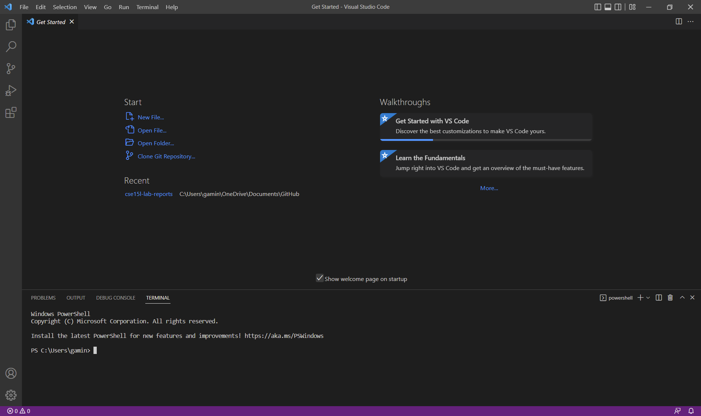
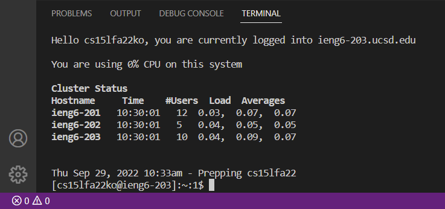
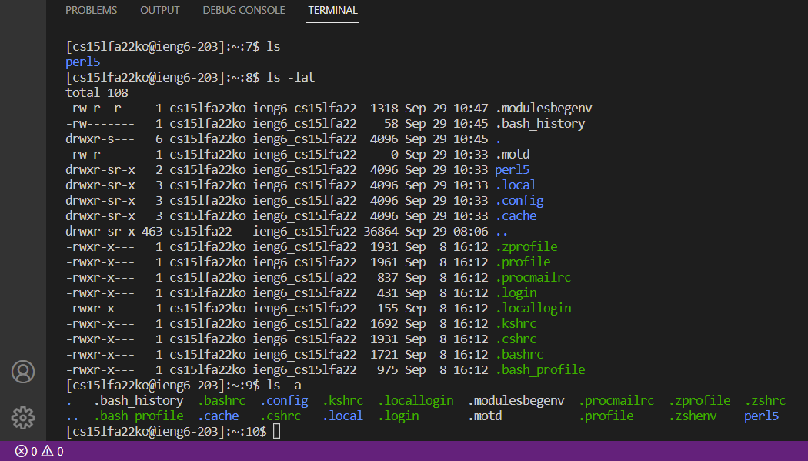
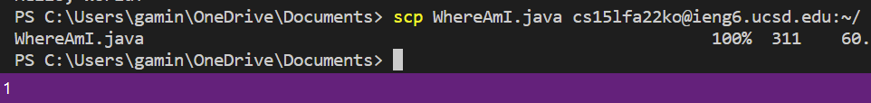
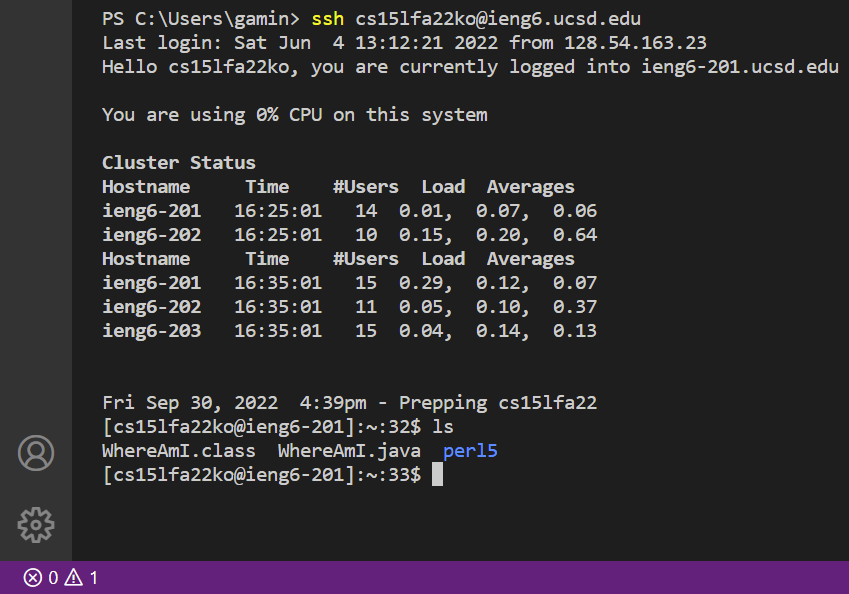
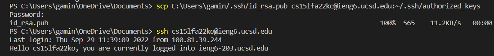
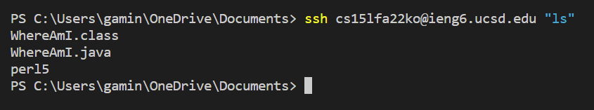

# SSH Tutorial

This is a tutorial on how to use **secure shell** (`ssh`) to remotely access another computer and log into a course-specific account on **ieng6**.

<br />

## What is SSH?
---

**Secure shell**, or `ssh` for short, was created by Tatu Ylonen. It provides a secure way to send data to another machine and prevents unauthorized persons from intercepting and reading the sent data.

<br />

## Getting Started
---

To use `ssh` you will need the following:
* Visual Studio Code, which can be downloaded [here](https://code.visualstudio.com/) for Window, Linux, and macOS. 
* A computer running an `ssh` server, which will be the computer you will control. If you are on Windows you will need to have [OpenSSH](https://learn.microsoft.com/en-us/windows-server/administration/openssh/openssh_install_firstuse?tabs=gui) installed.



<br />

## Connecting Remotely
---

Now you are finally ready to remotely connect to another computer. 
<br />
Open a new terminal in Visual Studio Code (`Terminal` -> `New Terminal`) and enter the command `ssh` followed by your course-specific account. For example:
<br />
```
$ ssh cs15lfa22zz@ieng6.ucsd.edu
```
If you encounter this message
```
The authenticity of host 'ieng6.ucsd.edu (128.54.70.227)' can't be established.
RSA key fingerprint is SHA256:ksruYwhnYH+sySHnHAtLUHngrPEyZTDl/1x99wUQcec.
Are you sure you want to continue connecting (yes/no/[fingerprint])?
```
just type `yes` and hit enter.

Now it will prompt you to enter your password. **Note** as you enter your password you may not see what you are typing. This is normal, just be sure to type it in correctly so you could log in.

After successfully logging in, you should see this



Congrats! You are now connected to another computer! Any command you run in your terminal will be run on your remote computer. 

If you wish to logout of the server, enter the command `exit`.

<br />

## Remotely Running Commands
---

Running commands on your remote server is simple, just keep in mind that your local computer may use a different operating system than the computer you are using remotely. This means that you may have to use different commands than you are used to in your remote server. For example, if your local computer uses Windows and the remote computer uses Linux, and you wanted to get a directory listing, instead of using the command `dir` you would need to use `ls -l`. Just something to keep in mind. Here is what it looks like to run commands on your remote computer:



In the above image, I used the commands `ls` and `ls -lat`.
<br />

## Moving Files with scp
---

If you need to send files between your local computer and your remote computer, you can do so using the `scp` command. This command will be run on your local computer and not on a remote server. Running the command will look like this:
```
scp [file name] cs15lfa22zz@ieng6.ucsd.edu:~/
```
Make sure you are in the same directory as the file you are sending. 

After running the command you will be asked to enter your password. Once you log into the remote server using `ssh` the file will be in the home directory. 




<br />

## SSH Keys
---

Entering your password whenever you log into your remote server can be avoided using **ssh keys**. Use the command `ssh-keygen` to create a *private key* file and a *public key* file. Then copy the *private key* to a location on your local computer and copy the *public key* to a location on the remote server. **ssh** will be able to use these files to log you in instead of needing a password. 




<br />

## Remote Running Optimization
---

There are a few ways to make the experience of running a remote server a bit easier. For example, if you want to run `ssh` and immediately log out, you could simply do something like this:
```
ssh cs15lfa22zz@ieng6.ucsd.edu "ls"
```

