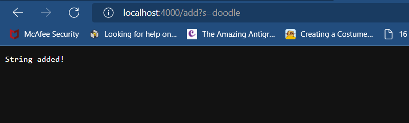
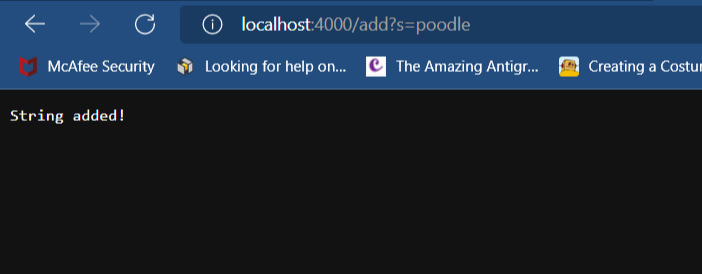
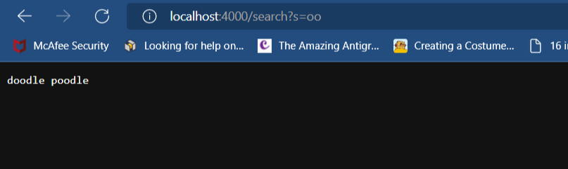
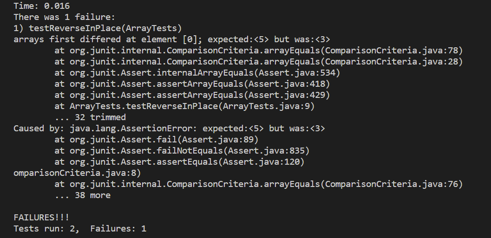
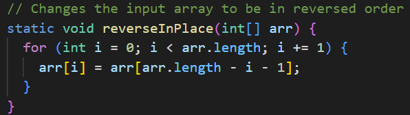
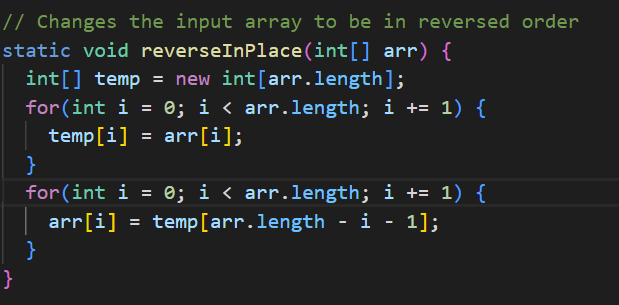
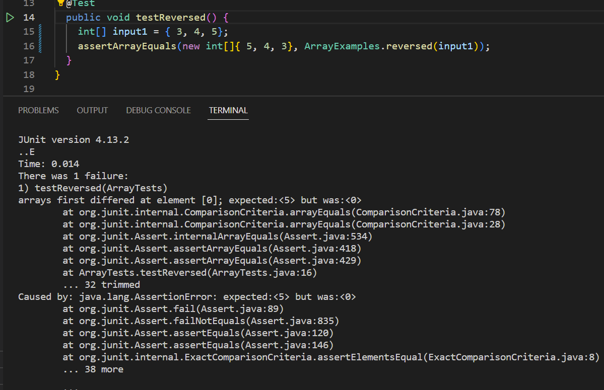
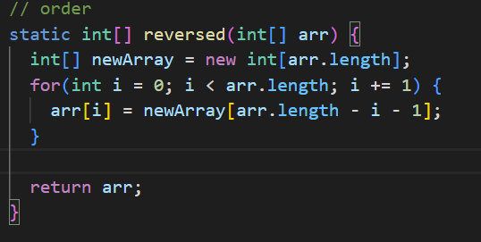
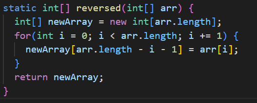

# Week 3 Lab Report

## **PART 1** - Simple Search Engine
---
To use it, simply type the path `/add?s=` to add a string to the list of strings, or `/search?s=` to search the list and return all strings that contain a given substring.
Here is the implementation:
```
class Handler implements URLHandler {

    ArrayList<String> inputList = new ArrayList<>();

    public String handleRequest(URI url) {
        if (url.getPath().equals("/")) {
            return String.format("Helloooo");
        } else {
            System.out.println("Path: " + url.getPath());
            if (url.getPath().contains("/add")) {
                String[] parameters = url.getQuery().split("=");
                if (parameters[0].equals("s")) {
                    inputList.add(parameters[1]);
                    return "String added!";
                }
            }
            if (url.getPath().contains("/search")) {
                String[] parameters = url.getQuery().split("=");
                if (parameters[0].equals("s")) {
                    String key = parameters[1];
                    String found = "";
                    for (int i = 0; i < inputList.size(); ++i) {
                        if (inputList.get(i).toUpperCase().contains(key.toUpperCase())) {
                            found += inputList.get(i);
                            found += " ";
                        }
                    }
                    if (found == "")
                        return "No strings found :(";

                    return found;
                }
            }
            return "404 Not Found!";
        }
    }
}
class SearchEngine {
    public static void main(String[] args) throws IOException {
        if(args.length == 0){
            System.out.println("Missing port number! Try any number between 1024 to 49151");
            return;
        }
        int port = Integer.parseInt(args[0]);
        Server.start(port, new Handler());
        
    }
}
```
The method will parse the path of the URL and check whether it should *add* a string to the list or *search* the list for strings that have a given substring. To do this, the code simply uses the `.contains()` method.
</br>
For example, if I wanted to add "doodle" to my list of strings I would add the path `/add?s=doodle` to the end of the URL.



Let's add "poodle" as well.


Now my list contains two words, "doodle" and "poodle". I can search the list for a substring by using the path `/search?s=`. The program does this by storing the given substring in a variable called `key`, and looping through every string in the list to check whether the substring is present in the string. If it is, it is displayed on the webpage.
</br>
Let's search for the substring "oo" just for demonstration using the path `/search?s=oo`.

And there we go. The program successfully found the words in the list that contained "oo".

## **PART 2** - Buggy Tests
---
Here are two bugs I found in the provided files for this lab.

</b>

### **Bug 1** - reverseInPlace

The method `reverseInPlace` is supposed to reverse the order of the contents in an array of integers. However, after testing it with array `{ 3, 4, 5 }` it produced this error:

It could not reverse the array because the algorithm is wrong. The line `arr[i] = arr[arr.length - i - 1]` is not enough to sort the elements.

One was to remedy this is to use a brute force solution that stores every element in the original array `arr` into a temporary one `temp`. Then replace the values of the original array by using this logic: `arr[i] = temp[arr.length - i - 1]`

The symptom was due to the fact that the array was not reversed, as the error shown in the above screenshot states. If the input array was no larger than 1 the test would have passed, but since the array I used was bigger than that, it was not able to accidentally produce the correct result. 

</br>

### **Bug 2** - reversed
`reversed` is supposed to return a new array containing the elements of a given array in reversed order.  This is the error I recieved after testing the method with array `{ 3, 4, 5 }` 

The problem with the code is that it's trying to store the contents in `newArray` inside of the input array `arr` and return `arr`. This is an issue because `newArray` does not contain the information we want to return.

To fix this, change `arr[i] = newArray[arr.length - i - 1]` to `newArray[arr.length - i - 1] = arr[i]` and return `newArray` instead of `arr`.

The symptom existed because the output array was not properly sorted since the initial algorithm was flawed. Just as the bug in the `reverseInPlace` method, if the input arrays size was less than two the test would pass, but since my array had three elements it was less likely to result in an erroneous pass.