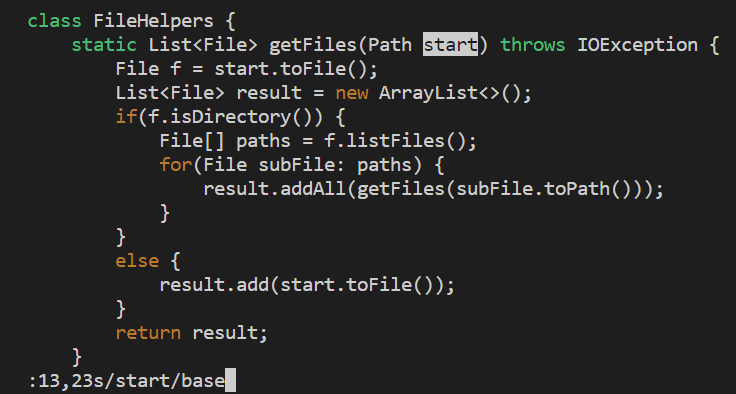
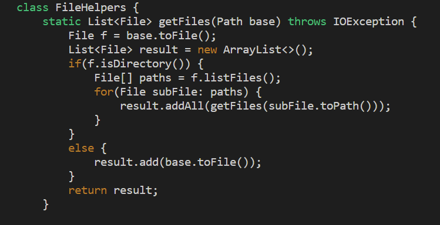

# Week 7 Lab Report

## **PART 1**
---

For part 1 this lab, I was instructed to give the shortest set of `vim` commands to perform a certain task. The task I will complete is changing the name of the `start` parameter to `base` in the `DocSearchServer.java` file from a previous lab. 

The shortest line of commands I found is this: `:13,23s/start/base`. This will tell the program to search the file for every instance of a word to be replaced within a given range. `13,23` is the range of the search. The `s` tells it to substitute one word with another. `start` is the word to be searched for, and `base` will replace each found instance of `start` in the given range. Here is how it looks to enter this command sequence in Normal mode:

After hitting `<Enter>` every instance of `start` from line 13 to 23 should be replaced with `base`.

## **PART 2**
---
After performing the task I did in part 1 of the lab on my local machine and using Visual Studio Code to edit the code and`scp` to send it to my remote server to run it, it took approximately 25 seconds to finish. To compare, it only took 10 seconds to finish editing and runnning the program when I was already logged into the remote server. I did not have any difficulties performing the tasks but it was tedious navigating from the local to the remote server and making sure the correct folders and files copied over in the right directory.

If I had to wor on a program that I was running remotely, I would rather edit it on the remote server using `vim`. It is easier for me and it takes less time than going back and forth from my local and remote servers just to share the edited program.

The task would preferably be easy to do in a few commands if I were to always use this method. I imagine if editing the code using `vim` becomes to strenuous of a task then I would just edit the code on my local machine and copy it over to the remote. 