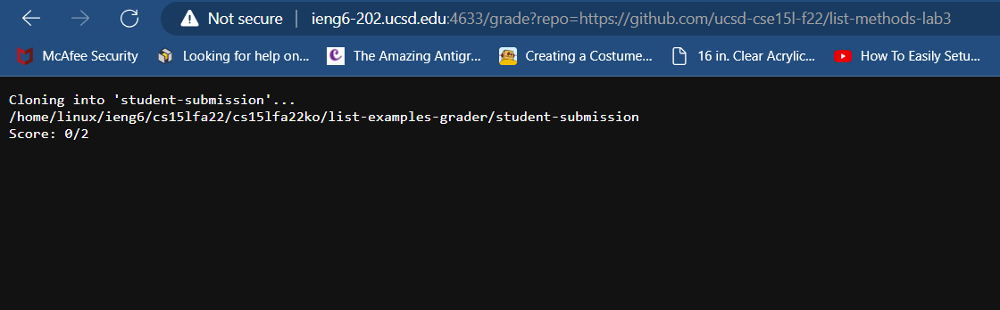
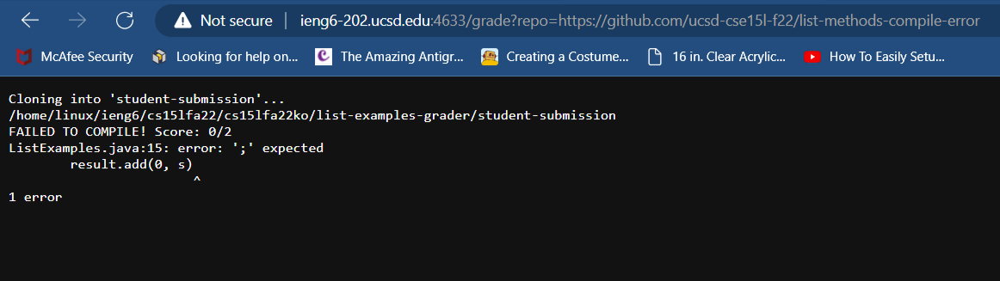
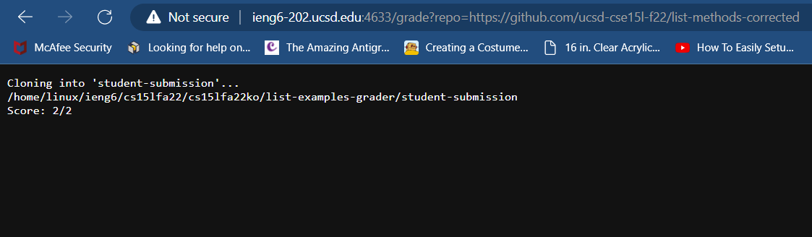

# Week 8 Lab Report

## **PART 1 - Demonstration**

Below is my `grade.sh` file.
```
# Create your grading script here
#set -e

SCORE="0"
CPATH=".:lib/hamcrest-core-1.3.jar:lib/junit-4.13.2.jar"

rm -rf student-submission
git clone $1 student-submission
cd student-submission

if [ ! -f ListExamples.java ]
then
        echo "ListExamples.java FILE NOT FOUND! Score: "$SCORE"/2"
        exit 1
fi

cd ..
cp -r lib student-submission/
cp TestListExamples.java student-submission/
cd student-submission
pwd
javac -cp $CPATH *.java 2> err.txt

if [ $? -ne 0 ]
then
        echo "FAILED TO COMPILE! Score: "$SCORE"/2"
        cat err.txt
        exit 1
fi

java -cp $CPATH org.junit.runner.JUnitCore TestListExamples 2> err.txt > out.txt

if [ $? -eq 0 ]
then
        echo "Score: 2/2"
else
        echo "Score: "$SCORE"/2"
fi
```
---

Here are some examples of it being ran from a browser.

Repo: https://github.com/ucsd-cse15l-f22/list-methods-lab3


Repo: https://github.com/ucsd-cse15l-f22/list-methods-compile-error


Repo: https://github.com/ucsd-cse15l-f22/list-methods-corrected


## **PART 2 - Tracing**
---

For this part, I will use this repository as an example: https://github.com/ucsd-cse15l-f22/list-methods-compile-error. This repo has an error that prevents the code from compiling successfully.


```
SCORE="0"
CPATH=".:lib/hamcrest-core-1.3.jar:lib/junit-4.13.2.jar"
```
These variables are used to keep track of the overall score of the repository being graded, and to store a long path that will be used more than once. This keeps things orgamized and easy to read and maintain.

---
```
rm -rf student-submission
git clone $1 student-submission
```
If `student-submission` already exists because the script was run before, it will need to be removed and replaced with the new repository that is to be tested. The commands in this block will return 0 because it will successfully find and remove the previous `student-submission` directory.

---
```
cd student-submission
```
Now we need to go to the `student-submission` folder. This command will return 0 since the directory exists.

---
```
if [ ! -f ListExamples.java ]
then
        echo "ListExamples.java FILE NOT FOUND! Score: "$SCORE"/2"
        exit 1
fi
```
The java file `ListExamples.java` needs to be present inside the students repo, so we will check if it is. If it is not, there will be an error thrown and the score will be afffected. The exit status will be 1 if the file is not present.
For the example, `ListExamples.java` exist, so the condition is false and the body of the `if` statement will not be run.

---
```
cd ..
cp -r lib student-submission/
cp TestListExamples.java student-submission/
cd student-submission
```
The first line of this code block will go back to the parent directory of `student-submission` and copy the `lib` folder and `TestListExamples.java` into it so they can be used to test the code. After this, we go back into `student-submission`. The `cp` command should return 0 since it should successfully copy everything over. `cd` will also return 0 since the directories we are travelling to exists.

---
```
pwd
javac -cp $CPATH *.java 2> err.txt
```
`pwd` will add the current working directory to the standard output and `javac` will compile the code, and put the standard error in `err.txt`. Since this repository had a compiler error, the error was stored in `err.txt`. The error states:
```
ListExamples.java:15: error: ';' expected
        result.add(0, s)
                        ^
1 error
```

---
```
if [ $? -ne 0 ]
then
        echo "FAILED TO COMPILE! Score: "$SCORE"/2"
        cat err.txt
        exit 1
fi
```
The `if` statement checks whether the exit code of the last command is 0 or nonzero after the code is compiled. If it is 0 this means the code compiled successfully, if not, an error was encountered while compiling.
The script uses the `echo` command to display an error message stating that the code did not compile, and it did not recieve a perfect score. It then prints the error message and returns 1.

---
```
java -cp $CPATH org.junit.runner.JUnitCore TestListExamples 2> err.txt > out.txt
```
This line will run the `TestListExamples.java` file to test the output of the code and ensure it gives the correct results. The standard error and standard output are put in their own `.txt` files. Unfortunately, the code did not compile and this line is not reached. 

---
```
if [ $? -eq 0 ]
then
        echo "Score: 2/2"
else
        echo "Score: "$SCORE"/2"
fi
```
The `if` statement in this block checks if the exit code for the last command is 0. If so, the score is a perfect 2/2. Because the tested repository did not compile successfully, these lines are never reached. 